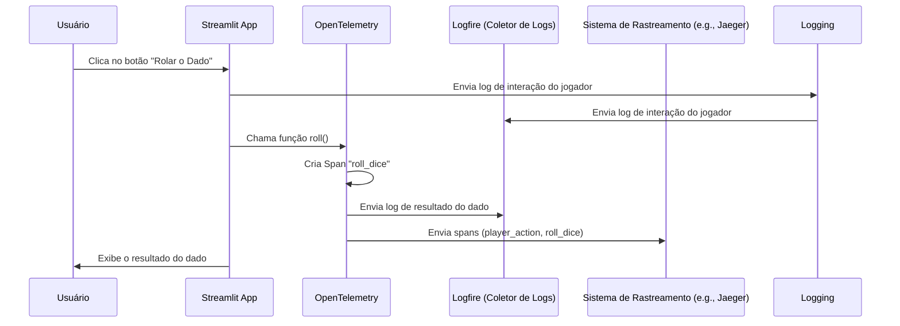

# README: Simulador de Dado com Streamlit e Instrumentação OpenTelemetry

Este projeto demonstra como realizar a **instrumentação manual** com Log em uma aplicação simples criada com Streamlit. A aplicação simula o lançamento de um dado, rastreando eventos como as jogadas do dado e interações dos jogadores através de spans de rastreamento.

---



### Explicação do Fluxo:

1. O **usuário** interage com a aplicação clicando no botão "Rolar o Dado".
2. A aplicação em **Streamlit**:
   - Cria um span `player_action` para rastrear a ação do jogador.
   - Notifica o **OpenTelemetry** e registra a interação no Logfire.
3. Durante o processo de lançamento do dado:
   - Um span `roll_dice` é criado em **OpenTelemetry**.
   - O resultado é registrado e enviado para o Logfire.
4. Os spans gerados (`player_action` e `roll_dice`) são enviados para o sistema de rastreamento (e.g., Jaeger).
5. O resultado do dado é exibido ao usuário.


---

## Funcionalidades

- **Simulador de Dado**: Simula o lançamento de um dado e exibe o resultado.
- **Integração com OpenTelemetry**: Realiza a instrumentação manual para gerar spans de rastreamento.
- **Input do Jogador**: Permite entrada opcional do nome do jogador para personalizar a interação.

---

## Requisitos

Certifique-se de ter os seguintes pré-requisitos instalados:

- Python 3.7 ou superior
- Streamlit
- OpenTelemetry API

Para instalar as dependências necessárias, execute:

```bash
pip install streamlit opentelemetry-api
```

---

## Estrutura do Código

### Principais Componentes

1. **Configuração do OpenTelemetry**:
   O tracer `streamlit.diceroller` é configurado para criar spans que rastreiam as operações de jogada de dado e interações do jogador.

   ```python
   from opentelemetry import trace
   tracer = trace.get_tracer("streamlit.diceroller")
   ```

2. **Função de Jogar o Dado**:
   A função `roll` simula o lançamento de um dado e cria um span (`roll_dice`) para rastrear a operação. O resultado do lançamento é registrado como um atributo do span.

   ```python
   def roll():
       with tracer.start_as_current_span("roll_dice") as roll_span:
           result = randint(1, 6)
           roll_span.set_attribute("roll.value", result)
           return result
   ```

3. **Interface do Streamlit**:
   - Exibe o título da aplicação.
   - Aceita o nome do jogador de forma opcional.
   - Gera um lançamento de dado ao clicar no botão, rastreando a ação do jogador em um span (`player_action`).

   ```python
   st.title("Instrumentação Manual com OpenTelemetry")
   player = st.text_input("Digite o nome do jogador (opcional):")

   if st.button("Rolar o Dado"):
       with tracer.start_as_current_span("player_action") as player_span:
           result = roll()
           player_span.set_attribute("player.name", player or "Anônimo")
           st.write(f"Resultado do dado: {result}")
   ```

---

## Como Rodar

1. Clone o repositório ou copie o código para um arquivo local (por exemplo, `app.py`).
2. Inicie a aplicação do Streamlit:

   ```bash
   streamlit run app.py
   ```

3. Abra o navegador e acesse `http://localhost:8501`.

---

## Rastreando com OpenTelemetry

Para capturar e exportar os rastreamentos, é necessário configurar um exportador OpenTelemetry (por exemplo, OTLP, Jaeger ou Zipkin). Adicione as dependências necessárias para o SDK e o exportador à sua instalação e configure o backend para rastreamento.

Exemplo (usando o exportador OTLP):
```bash
pip install opentelemetry-sdk opentelemetry-exporter-otlp
```

Configure o tracer no código:

```python
from opentelemetry.sdk.trace import TracerProvider
from opentelemetry.sdk.trace.export import BatchSpanProcessor
from opentelemetry.exporter.otlp.proto.grpc.trace_exporter import OTLPSpanExporter

trace.set_tracer_provider(TracerProvider())
tracer_provider = trace.get_tracer_provider()

otlp_exporter = OTLPSpanExporter(endpoint="seu-endpoint-otlp")
span_processor = BatchSpanProcessor(otlp_exporter)
tracer_provider.add_span_processor(span_processor)
```

---

## Personalização

- Atualize a lógica de jogada na função `roll` para simular diferentes tipos de dados ou resultados.
- Estenda o span de interação do jogador (`player_action`) para incluir atributos ou eventos adicionais.

---

## Contribuindo

Sinta-se à vontade para fazer um fork do projeto e enviar pull requests com novas funcionalidades ou melhorias.

---

## Licença

Este projeto é licenciado sob a Licença MIT. Consulte o arquivo [LICENSE](LICENSE) para mais detalhes.